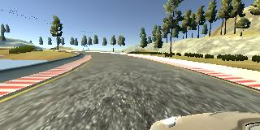
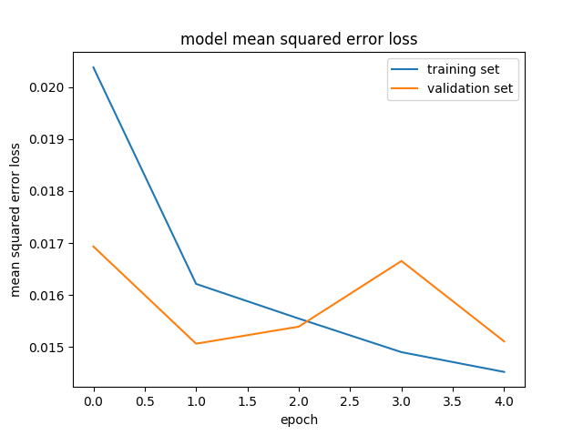

# **Behavioral Cloning** 

## Writeup Template

### You can use this file as a template for your writeup if you want to submit it as a markdown file, but feel free to use some other method and submit a pdf if you prefer.

---

**Behavioral Cloning Project**

The goals / steps of this project are the following:
* Use the simulator to collect data of good driving behavior
* Build, a convolution neural network in Keras that predicts steering angles from images
* Train and validate the model with a training and validation set
* Test that the model successfully drives around track one without leaving the road
* Summarize the results with a written report

[//]: # (Image References)

## Rubric Points
### Here I will consider the [rubric points](https://review.udacity.com/#!/rubrics/432/view) individually and describe how I addressed each point in my implementation.  

---
### Files Submitted & Code Quality

#### 1. Submission includes all required files and can be used to run the simulator in autonomous mode

My project includes the following files:
* model.py containing the script to create and train the model
* drive.py for driving the car in autonomous mode
* model.h5 containing a trained convolution neural network 
* writeup_report.md or writeup_report.pdf summarizing the results
* video.mp4 containing a video recording of the vehicle driving autonomously at least one lap around the track.

#### 2. Submission includes functional code
Using the Udacity provided simulator and my drive.py file, the car can be driven autonomously around the track by executing 
python drive.py model.h5

#### 3. Submission code is usable and readable

The model.py file contains the code for training and saving the convolution neural network. The file shows the pipeline I used for training and validating the model.

### Model Architecture and Training Strategy

#### 1. An appropriate model architecture has been employed

My model consists of a NVIDIA architecture model as shown below:

The model includes RELU layers to introduce nonlinearity and the data is normalized in the model using a Keras lambda layer.

#### 2. Attempts to reduce overfitting in the model

The model contains normalization,flipping and cropping of images in order to reduce overfitting.

The model was trained and validated on different kind of images sets to ensure that the model was not overfitting. The model was tested by running it through the simulator and ensuring that the vehicle could stay on the track for at least 1 lap.

#### 3. Model parameter tuning

The model used an adam optimizer, so the learning rate need not be tuned manually.The left and right images had an offset measurement of 0.2 which was determined by trial and error.

#### 4. Appropriate training data

Training data was given my Udacity where I drove the car manually in a simulator to keep the vehicle driving on the road. I used a combination of center lane ,left and right images. All these images were flipped so the car can learn clockwise driving and can take care of the situation where the car has to recover from the sides.

### Model Architecture and Training Strategy

#### 1. Solution Design Approach

My first step was to use a simple neural network to analyse the loss.I split my image and steering angle data into a training and validation set. The car went into water so I includes normalization and cropping but the model still failed to take steep turns.  Then I decided to use the convolution neural network model similar to NVIDIA's .I thought this model might be appropriate because it has been used in real time on self driving cars due to its size and complexity.

Data augmentation was done by adding left and right images and flipping them to obtain a comphrehensive training data.
The final step was to run the simulator to see how well the car was driving around track one. There were a few spots where the vehicle fell off the track to improve the driving behavior in these cases so I converted the image from BGR to RGB in OpenCV. drive.py reads images in RGB so this step was a must.

Also the images were NOT resized since I had CUDA setup which could handle complex computations.
At the end of the process, the vehicle is able to drive autonomously around the track without leaving the road.

#### 2. Final Model Architecture

The final model architecture (model.py lines 18-24) consisted of a convolution neural network with the following layers and layer sizes :

#### 3. Creation of the Training Set & Training Process

To capture good driving behavior, I first recorded 4-5 laps on track one using center lane driving. Here is an example image of center lane driving:

I then collected left and right images as well for every corresponding center image.

To augment the data sat, I also flipped images and angles thinking that this would emulate the car moving in a clockwise path.

After the collection process, I had 29472 number of images. I then preprocessed this data by normalizing and cropping each image.

I finally randomly shuffled the data set and put 20% of the data into a validation set. 

I used this training data for training the model.The validation set helped determine if the model was over or under fitting. The ideal number of epochs was 5 by trial and error. I used an adam optimizer so that manually training the learning rate wasn't necessary.

Here is the graph that shows the error between the epochs and model mean squared error:

